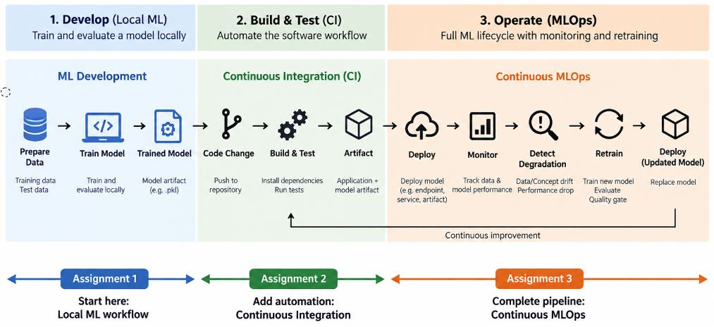

# Machine Learning Operations (MLOps) 

## Related Courses

The material in this repository is used across two courses in the
**Data Science and Artificial Intelligence (Master)** programme at
FH JOANNEUM:

- [DevOps and MLOps](https://www.fh-joanneum.at/hochschule/person/kurt-klaus-horvath/)
- [MLOps and Continuous Monitoring](https://www.fh-joanneum.at/hochschule/person/kurt-klaus-horvath/)

The assignments in this repository provide a practical progression from
basic ML model development through DevOps automation to continuous MLOps
and model monitoring.

The assignments build logically on each other, moving from a simple local ML workflow to
automated software development and finally to a continuous MLOps lifecycle.
However, each assignment comes with a full set of code to perform it.

## Assignments

### [Assignment 1 – From Machine Learning to MLOps](./Assignment1)

Train and evaluate a machine learning model locally and explore how DevOps and
MLOps are used in everyday internet applications.

**Focus:** Machine Learning · DevOps · MLOps

---

### [Assignment 2 – Continuous Integration with Azure DevOps](./Assignment2)

Build a Continuous Integration pipeline for a Python application using
Azure DevOps.

**Focus:** Git · CI · Azure DevOps · Automated Testing · Artifacts

---

### [Assignment 3 – Continuous MLOps with Azure DevOps](./Assignment3)

Build a continuous MLOps workflow that trains, evaluates, deploys, monitors,
detects model degradation, retrains, and deploys an updated model.

**Focus:** MLOps · Monitoring · Drift Detection · Retraining · Quality Gates

---

## Contact Lecturer

**Univ.-Ass. DI Dr.techn. Kurt Klaus Horvath, BSc**  
Email: kurt.horvath@fh-joanneum.at  
Email: kurt.horvath@aau.at  
Email: kurtklaus.horvath@gmail.com

Website: https://www.itec.aau.at/~kurt/

